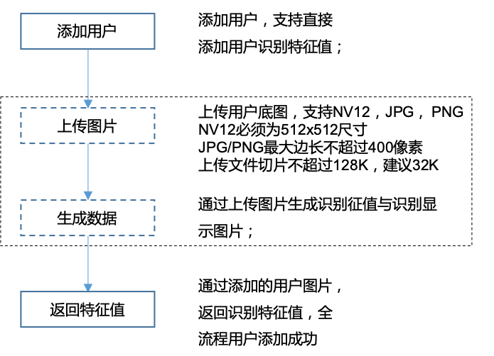

# 帐户管理
-----------

#### 说明

>请求类型: POST
>HTTP头：token = , 使用登陆时返回的token
>请求消息体:JSON
>返回消息体:JSON, retcode = 0时正确， 非0时出错

独立模式时：
>请求URL: http://dev-ip-addr:port:/api/v3.x/acm
>HTTP头：token = , 使用登陆时返回的token

**限制条件： uid与gid 不超过32字节,建议采用base58编码UUID为24字节字符串方案**

#### 用户对象

```json
{
    "uid": "1avsoHu2EeqZmH943F8eUg",    // 用户ID，全局唯一
    "gid": "abvsoHu2EqZmH942dadebA",    // 用户所在组ID

    "face":{
        "vendor":"xxxx",       // 人脸算法供应商，double check使用
        "version":"v2.1.0",     // 人脸算法版本, double check使用
        "feature": "data...."   // base64编码的用户特征值，由设备计算，同类型设备，算法版本一致的可以直接下载，节省时间
    },
}
```

> 对用户的操作与数据库的CRUD类似，增加了枚举设备中的所有用户，所有的信息以此为准
> 后续行文为了简化，直接给出用户信息的缩略版本


#### 添加用户流程





#### 列举用户

- 请求

```json
{
    "action": "user-fetch",

    "header":{
        "reqid":"129393"         // 透传值，设备内唯一
    },
    
    "body":{
        "offset": 1,
        "limit": 2
    }
}
```

>offset : 本次列表开始的位置；
>limit : 本次列表的数量;


- 响应

```json
{
    "retcode":0,                // 激活成功
    "header":{
        "reqid":"129393",       // 透传值，设备内唯一
    },
    
    "body":{
        "users": [
            {
                "uid": "1avsoHu2EeqZmH943F8eUg",
            },
            {
                "uid": "1aw6wHu2EeqZmH943F8eUg",
            }
        ],
    }
```

#### 添加用户

- 请求

```json
{
    "action": "user-insert",

    "header":{
        "reqid":"129393"         // 透传值，设备内唯一
    },
    
    "body":{
        "users": [
            {
                "uid": "1avsoHu2EeqZmH943F8eUg",
                ... // 用户的其它信息，请参照本章的用户对象说明
            },
            {
                "uid": "1aw6wHu2EeqZmH943F8eUg",
                ... // 用户的其它信息，请参照本章的用户对象说明
            }
        ]
    }
}
```

- 响应

```json
{
    "retcode": 0,   // 当有任意一项成功时，返回成功

    "header":{
        "reqid":"129393"         // 透传值，设备内唯一
    },

    "body":{
        "users": [
            { 
                "uid":"1avsoHu2EeqZmH943F8eUg",
                "retcode": 0    // 本用户操作结果
            },
            {
                "uid":"1aw6wHu2EeqZmH943F8eUg",
                "retcode": 0    // 本用户操作结果
            }
        ]
    }
}
```

#### 删除用户

- 请求

```json
{
    "action": "user-remove",

    "header":{
        "reqid":"129393"         // 透传值，设备内唯一
    },

    "body":{
        "users": [
        {
            "uid": "1avsoHu2EeqZmH943F8eUg"
        },
        {
            "uid": "1aw6wHu2EeqZmH943F8eUg"
        }
        ]
    }
}
```

>uid : 唯一标志用户的ID，不超过32字节的文本字符串；必填

- 响应

```json
{
    "retcode": 0,   // 当有任意一项成功时，返回成功

    "header":{
        "reqid":"129393"         // 透传值，设备内唯一
    },

    "body":{
        "users": [
        {
            "uid": "1avsoHu2EeqZmH943F8eUg",
            "retcode": 0    // 本用户操作结果
        },
        {
            "uid": "1aw6wHu2EeqZmH943F8eUg",
            "retcode": 0    // 本用户操作结果
        }
        ]
    }
}
```

#### 修改用户

- 请求

```json
{
    "action": "user-update",

    "header":{
        "reqid":"129393"         // 透传值，设备内唯一
    },

    "body":{
        "users": [
        {
            "uid": "1avsoHu2EeqZmH943F8eUg",
            ... // 用户的其它信息，请参照本章的用户对象说明
        },
        {
            "uid": "1aw6wHu2EeqZmH943F8eUg",
            ... // 用户的其它信息，请参照本章的用户对象说明
        }
        ]
    }
}
```

- 响应

```json
{
    "retcode": 0,   // 当有任意一项成功时，返回成功

    "header":{
        "reqid":"129393"         // 透传值，设备内唯一
    },

    "body": {
        "users": [
        {
            "uid": "1avsoHu2EeqZmH943F8eUg",
            "retcode": 0    // 本用户操作结果
        },

        {
            "uid": "1aw6wHu2EeqZmH943F8eUg",
            "retcode": 0    // 本用户操作结果
        }
        ]
    },
}
```

#### 查询用户

- 请求

```json
{
    "action": "user-lookup",
 
    "header":{
        "reqid":"129393"         // 透传值，设备内唯一
    },
    
    "body":{
        "users": [
        {
            "uid": "1avsoHu2EeqZmH943F8eUg",
            "face":1,   // 查询信息是否附加用户的人脸特征信息，不填或0则不添加，1为添加查询人脸特征信息
        },
        {
            "uid": "1aw6wHu2EeqZmH943F8eUg",
        }
        ]
    }
}
```

- 响应

```json

{
    "retcode": 0,   // 当有任意一项成功时，返回成功

    "header":{
        "reqid":"129393"         // 透传值，设备内唯一
    },
    
    "body":{
        "users": [
        {
            "uid": "1avsoHu2EeqZmH943F8eUg",
            ... // 用户的其它信息，请参照本章的用户对象说明
        },
        {
            "uid": "1aw6wHu2EeqZmH943F8eUg",
            ... // 用户的其它信息，请参照本章的用户对象说明
        }
        ]
    }
}
```

#### 上传用户文件

**上传用户文件，单次数据长度必须在64kB以内，其data数据在转base64前应以64kB长度切片**

- 请求

```json
{
    "action":"user-upload",
    
    "header":{
        "reqid":"129393"         // 透传值，设备内唯一
    },

    "body":{
        "filesize":32678,
        "filename":"1aw6wHu2EeqZmH943F8eUg.jpg", // 文件名后缀代表文件类型，支持nv12, jpg, png
        "offset":0,
        "size": 4096,
        "data":"base64-encoded file data"
    }
}
```

>filename : 用户ID + 后缀, nv12时为nv12文件，使用512x512的人脸图片，做底库使用。jpg, png时，人脸图片最大边（长或宽）不超过400像素，人脸大小大于200像素
>filesize : 文件总的长度
>offset : 当前数据片段起始位置
>size : 当前数据片段长度
>data : base64编码的数据

- 响应

```json
{
    "retcode":0,

    "header":{
        "reqid":"129393"         // 透传值，设备内唯一
    },
}
```

#### 生成用户数据

根据上传的用户数据，生成用户识别特征码数据

- 请求

```json
{
    "action": "user-gen",
    
    "header":{
        "reqid":"129393"         // 透传值，设备内唯一
    },
    
    "body":{
        "uid": "1avsoHu2EeqZmH943F8eUg",
    }
}
```

- 响应

```json
{
    "retcode":0,

    "header":{
        "reqid":"129393"         // 透传值，设备内唯一
    },

    "body": {
        "uid": "1avsoHu2EeqZmH943F8eUg",

        "face":{
            "vendor":"xxxx",       // 人脸算法供应商，double check使用
            "version":"v2.1.0",     // 人脸算法版本, double check使用
            "feature": "data...."   // base64编码的用户特征值，由设备计算，同类型设备，算法版本一致的可以直接下载，节省时间
        }
    }
}
```
